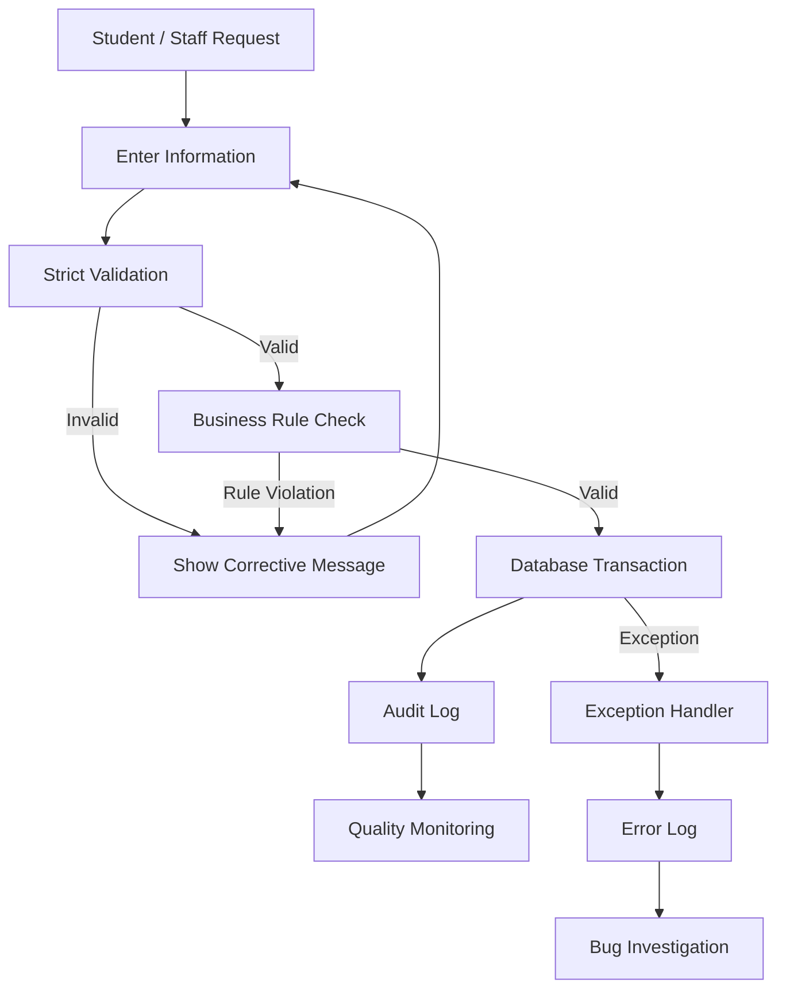

# Process Map

## Main Hostel Process

## Room Allocation

Input → Validation → Availability Check → Allocation → Audit → Monitoring

## Complaint Resolution

Complaint → Validation → Assignment → Investigation → Resolution → Verification → Closure → Monitoring
