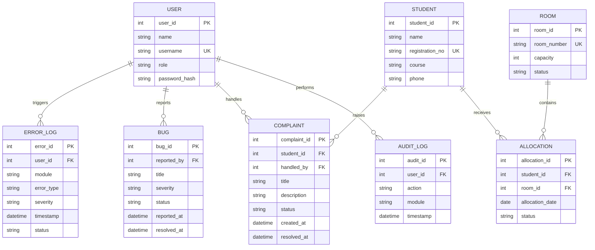

# ER Diagram

The initial logical data model is shown below. It will be refined during database implementation.

```mermaid
erDiagram
    USER ||--o{ AUDIT_LOG : performs
    USER ||--o{ COMPLAINT : handles
    STUDENT ||--o{ ALLOCATION : receives
    ROOM ||--o{ ALLOCATION : contains
    STUDENT ||--o{ COMPLAINT : raises
    USER ||--o{ BUG : reports
    USER ||--o{ ERROR_LOG : triggers

    USER {
        int user_id PK
        string name
        string username UK
        string role
        string password_hash
    }

    STUDENT {
        int student_id PK
        string name
        string registration_no UK
        string course
        string phone
    }

    ROOM {
        int room_id PK
        string room_number UK
        int capacity
        string status
    }

    ALLOCATION {
        int allocation_id PK
        int student_id FK
        int room_id FK
        date allocation_date
        string status
    }

    COMPLAINT {
        int complaint_id PK
        int student_id FK
        int handled_by FK
        string title
        string description
        string status
        datetime created_at
        datetime resolved_at
    }

    AUDIT_LOG {
        int audit_id PK
        int user_id FK
        string action
        string module
        datetime timestamp
    }

    ERROR_LOG {
        int error_id PK
        int user_id FK
        string module
        string error_type
        string severity
        datetime timestamp
        string status
    }

    BUG {
        int bug_id PK
        int reported_by FK
        string title
        string severity
        string status
        datetime reported_at
        datetime resolved_at
    }
```
