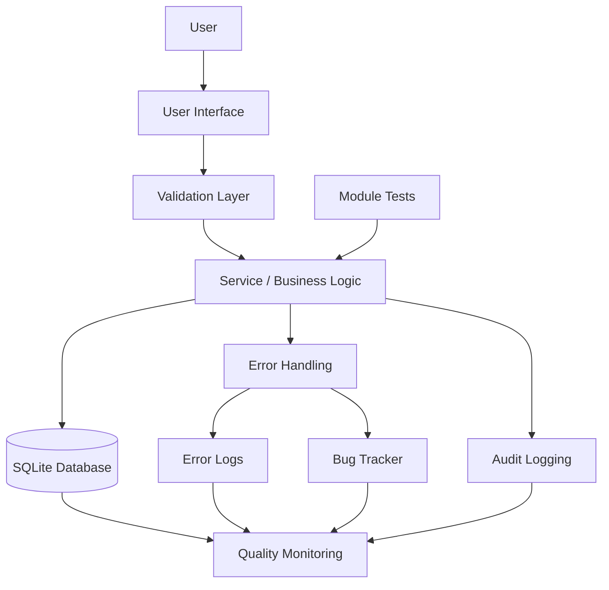

# System Architecture

## High-Level Flow



## Quality Control Flow

```text
User Action
    ↓
Input Validation
    ↓
Business Rule Check
    ↓
Database Transaction
    ↓
Audit Record
    ↓
Quality Metric

If an exception occurs:
    ↓
Controlled Exception Handler
    ↓
Friendly User Message
    ↓
Error Log
    ↓
Investigation / Bug Tracker if confirmed as a defect
```

## Design Principle

The system separates user interface, validation, business logic, data access and quality/error services so that defects can be isolated and controlled more easily.
